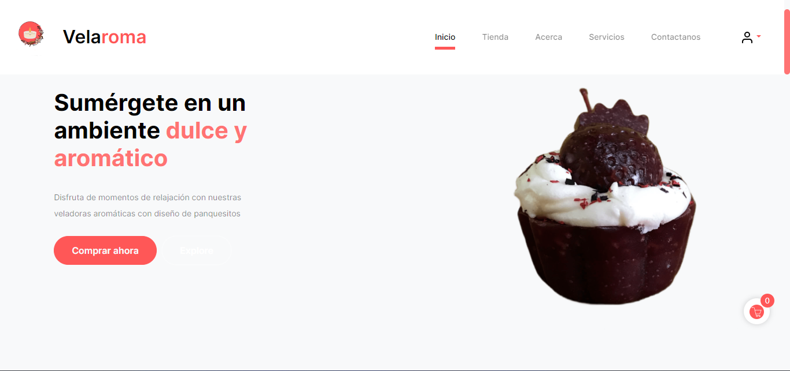
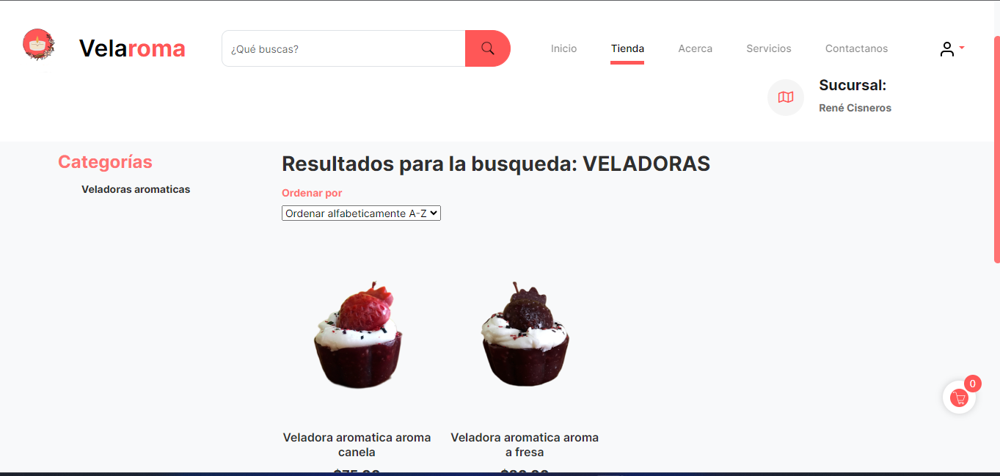
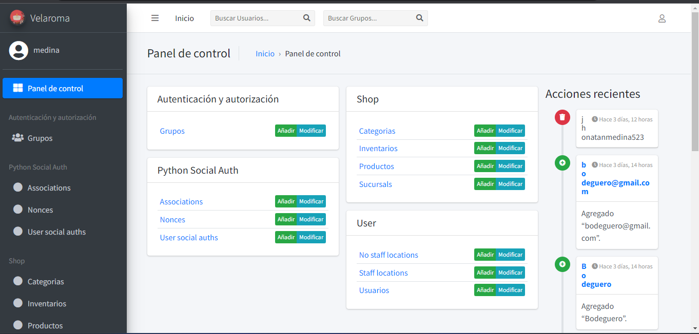

# Project4: Velaroma

Velaroma es una tienda en línea dedicada a la comercialización de veladoras aromáticas en forma de cupcakes donde podrás comprar tus veladoras aromaticas!

## Imagenes del proyecto

### Landing page

### Tienda

### Uso de API de Google Maps para localización

### Alertas y tooltips

### Admin Django

## Características:

### Cliente:
- **Registrar ubicación**: Búsqueda manual o ubicación automática mediante GPS.
- **Gestionar direcciones almacenadas**: Ejemplo: Casa, casa de mamá, trabajo.
- **Registrarse en la tienda**: de forma escrita o mediante cuenta de Google (API de Google).
- **Cambio de sucursal**: Los clientes pueden cambiar de sucursal para poder visualizar los productos de esa sucursal en especifico. 
- **Flujo de carrito de compras**: Agregar productos al carrito, limpiar el carrito de compras, ir a la vista de pago.
- **Envío de mensajes a números de cuentas de WhatsApp**: La funcionalidad actual es enviar mediante un botón con un mensaje predeterminado, [ver prueba](/pruebitaWhatsapp).

### Trabajadores:
- **Gestión de roles y permisos**: Para los trabajadores con opciones dinámicas según su rol y permisos en el sistema.
- **Gestionar la tienda**: Gestionar sucursales, productos, categorías e inventario.
- **Uso de Claudinary**: Para subir imágenes del negocio, almacenando la URL en la base de datos.

## Tecnologías:
- **Backend**: Python y Django.
- **Frontend**: HTML, CSS, Javascript (Uso de librería de javascript de GASP para animcaciones) Jinja2 para renderización de templates y template Jazzmin para el admin de Django
- **Base de datos**: PostgreSQL.
-  **APIs**: Google Auth 2.0, Geolocalización y Places de Google, Claudinary para almacenamiento de imagenes, API de Meta WhatsApp para el envío de mensajes a cuentas.
 

## Instalación:

1. Clonar el repositorio
git clone `https://github.com/CyberMedina/cs50w-project4.git`
2. Crear un entorno virtual de Python `python -m venv env`, luego activarlo con `.\env\Scripts\activate`
3. Instalar los requerimientos del proyecto `pip install -r .\requirements.txt`
4. Renombrar el archivo ".env.template" a ".env" en la raíz del proyecto
5. Editar el archivo ".env" con los datos de conexión de la base de datos PostgreSQL
6. Crear migraciones `python manage.py makemigrations`
7. Aplicar migraciones `python manage.py migrate`
8. Crear un superusuario para acceder al administrador `python manage.py createsuperuser`
9. Ejecutar la aplicación `python manage.py runserver`

## Autor
**Jhonatan Jazmil Medina Aguirre**

**Grupo D (GOD)**
